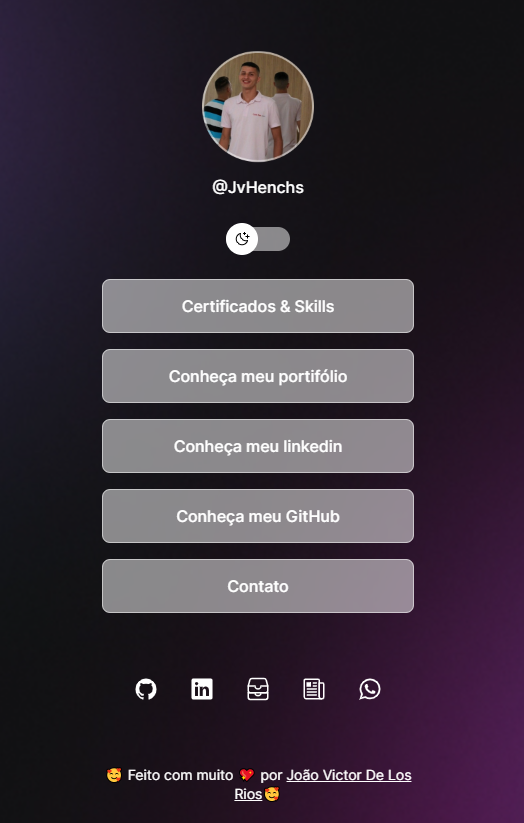

<h1 align="center"> Links do Portfólio </h1>

  

🚀 Tecnologias
Este projeto foi desenvolvido utilizando as seguintes tecnologias:

HTML e CSS
JavaScript
Git e Github
Figma
💻 Sobre o Projeto
Bem-vindo ao meu portfólio online! Este projeto funciona como um agregador de vários links importantes, servindo essencialmente como um cartão de visita digital.

Feito com ♥
